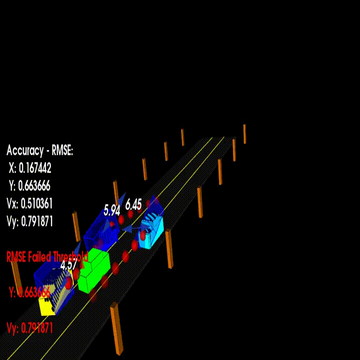

# SFND_Unscented_Kalman_Filter
Sensor Fusion UKF Highway Project 


This project implements an Unscented Kalman Filter to estimate the state of multiple cars on a highway using noisy lidar and radar measurements. In order to check the validity and accuracy of the filter; RMSE values are obtained and checked whether the tolerance outlined in the project rubric is met. 

The main program can be built and ran by doing the following from the project top directory.

1. mkdir build
2. cd build
3. cmake ..
4. make
5. ./ukf_highway

Note that the unscented filter logic is written in src/ukf.cpp, and src/ukf.h

The program main.cpp has already been filled out, but  modified to tailor to my need.

Here red spheres are lidar markers for each car and spheres are the predicted positions by the filter in future


`main.cpp` is using `highway.h` to create a straight 3 lane highway environment with 3 traffic cars and the main ego car at the center. 
The viewer scene is centered around the ego car and the coordinate system is relative to the ego car as well. The ego car is green while the 
other traffic cars are blue. The traffic cars will be accelerating and altering their steering to change lanes. Each of the traffic car's has
it's own UKF object generated for it, and will update each indidual one during every time step. 

The red spheres above cars represent the (x,y) lidar detection and the purple lines show the radar measurements with the velocity magnitude along the detected angle. The Z axis is not taken into account for tracking, so you are only tracking along the X/Y axis.

---

## Checking the Consistency of the UKF
* Using NIS for the updated parameters for both Lidar and Radar. The calculation is performed inside the update lidar and update radar functions in the ukf.cpp

NIS follows chi-squared distribution therefore using the standard table to expect the NIS value. nf refers for the degrees of freedom, 2 for lidar and 3 for radar as those are measurement dimensions for both the sensors


Choosing 0.05=7.815 for Radar and 5.991 for lidar; as the limit so that there must be 95% of the data points should be near that line.

Refer to the build folder where all the NIS values for radar and lidar are being written to respective .txt files
after running the filter once the files are written, run NIS_Plotting.py to save the NIS plot to the Output_Images folder for  both lidar and radar

Sensor fusion for a better converging filter
std_a_ = 0.8(Process noise standard deviation longitudinal acceleration m/s2)  std_yawdd_ = 0.5(Process noise standard deviation yaw acceleration rad/s2)

 

Result of the pcl viewer for the above case : Threshold criteria met rmseThreshold = {0.30,0.16,0.95,0.70};


Sensor fusion for a better converging filter but with more process noise:  std_a_ = 30(Process noise standard deviation longitudinal acceleration m/s2);std_yawdd_ = 30(Process noise standard deviation yaw acceleration rad/s2);


Result of the pcl viewer for the above case : Threshold criteria not met rmseThreshold = {0.30,0.16,0.95,0.70}, as the process noise needs to be tunned


Only lidar single sensor used to converge filter not as good as results achieved by sensor fusion of lidar and radar


Result of the pcl viewer for the above case : Threshold criteria not met rmseThreshold = {0.30,0.16,0.95,0.70}, as single sensor filter convergence is not that good 


Only radar single sensor used to converge filter not as results achieved by sensor fusion of lidar and radar


Result of the pcl viewer for the above case : Threshold criteria not met rmseThreshold = {0.30,0.16,0.95,0.70}, as single sensor filter convergence is not that good 


### Optional Assignment

Using lidar measurements from the raw point cloud clustering of the obstacles and taking the x,y (2D) projection of the mid point of the smallest 3d box drawn enclosing  around the point cloud.


Result of the pcl viewer for the above case : Threshold criteria not met rmseThreshold = {0.30,0.16,0.95,0.70}, as issue with the point cloud's centeroid concept and limitation of the point clouds reflected from  the lidar
Here blue spheres are the midpoint of the 3D bbox projected in the xy plane ; red spheres  are the predicted positions by the filter in future


#### Explanation:

 * As the points rendered and received by the lidar on the ego car are coming from only the parts of the obstacle vehicles those are facing the lidar directly and hence the centroid estimate for calculation of the 3D smallest enclosing bounding box tranformation is not the actual center but a rough estimate.

 * Moreover, the bounding box calculation involves float type points and point clouds which is not as precise as double.



#### Solution to the above problem:
  As it can be seen as not all the point clouds are considered to calculate the transformed bounding box.
  Possible approach:
  * Some other data fusion like camera and deep learning bounding box centroid estimator network could be used which  
  could be trained on various car models. In simple words train to render complete car body by looking partial body visible along with the knowledge of the make of the car.
  * Doing some naive transformations could also improve the estimate of the bounding box center.
  * Also some additional lidar could be added to cover various blind spots. This could be done in this assignment too.   

#### Implementation of finding the smallest bounding box fitting the point cloud using PCA logic

Refer to processPointClouds.cpp's BoundingBoxQ function 


```cpp

//function for getting the smallest and best fit bounding box for a given point cloud
template <typename PointT>
BoxQ ProcessPointClouds<PointT>::BoundingBoxQ(typename pcl::PointCloud<PointT>::Ptr cluster)
{
    //Compute principal directions
    //Getting the eigenvectors  via the PCL PCA interface:
    Eigen::Vector4f pcaCentroid;
    pcl::compute3DCentroid(*cluster, pcaCentroid);
    typename pcl::PointCloud<PointT>::Ptr cloudPCAprojection (new pcl::PointCloud<PointT>);
    pcl::PCA<PointT> pca;
    pca.setInputCloud(cluster);
    pca.project(*cluster, *cloudPCAprojection);
    //std::cerr << std::endl << "EigenVectors: " << pca.getEigenVectors() << std::endl;
    //std::cerr << std::endl << "EigenValues: " << pca.getEigenValues() << std::endl;


   

    // Transform the original cloud to the origin where the principal components correspond to the axes.
    Eigen::Matrix4f projectionTransform(Eigen::Matrix4f::Identity());
    projectionTransform.block<3,3>(0,0) = pca.getEigenVectors().transpose();
    projectionTransform.block<3,1>(0,3) = -1.f * (projectionTransform.block<3,3>(0,0) * pcaCentroid.head<3>());
    typename pcl::PointCloud<PointT>::Ptr cloudPointsProjected (new pcl::PointCloud<PointT>);
    pcl::transformPointCloud(*cluster, *cloudPointsProjected, projectionTransform);
    // Get the minimum and maximum points of the transformed cloud.
    PointT minPoint, maxPoint;
    pcl::getMinMax3D(*cloudPointsProjected, minPoint, maxPoint);
    const Eigen::Vector3f meanDiagonal = 0.5f*(maxPoint.getVector3fMap() + minPoint.getVector3fMap());
    

    //Final transform
    const Eigen::Quaternionf bboxQuaternion(pca.getEigenVectors()); //Quaternions are a way to do rotations https://www.youtube.com/watch?v=mHVwd8gYLnI
    const Eigen::Vector3f bboxTransform = pca.getEigenVectors() * meanDiagonal + pcaCentroid.head<3>();
    
    BoxQ box;
    box.bboxQuaternion = bboxQuaternion;
    box.bboxTransform = bboxTransform;
    box.cube_length = maxPoint.x - minPoint.x;
    box.cube_width = maxPoint.y - minPoint.y;
    box.cube_height = maxPoint.z - minPoint.z;


    return box;
}

```

## Functioning of the UKF(Unscented Kalman Filter)


Principle of UKF is that it tries to represent and solve non linear and non Gaussian systems by approximating them as gaussian using sigma points those are selected using UKF's algorithm and lamda value those are used to calculate the weights for these sigma points depending on where they are in the distribution assumed.

Proccess Model and Motion Model are required for any UKF to interact or in other words predict and update recursively 
### Stage 1 Prediction
* Generating Sigma Points
	
	```cpp
	// creating augmented mean state x_aug and intialising it to zero and filling the head of the vector with state vector received from measurement package
	// of the sensor
	Eigen::VectorXd x_aug = VectorXd(this->n_aug_);
	x_aug.fill(0.0);
	x_aug.head(this->n_x_) = this->x_;
	


	// creating augmented covariance matrix P_aug and intialising it to zero first and then filling the top left corner of the
	// matrix with covariance matrix set 
	Eigen::MatrixXd P_aug = MatrixXd(this->n_aug_ , this->n_aug_);
	P_aug.fill(0.0);
	P_aug.topLeftCorner(this->n_x_,this->n_x_) = this->P_;

	// add Q matrice or the Process noise matrix  to the bottom right corner of augmented covariance matrix P_aug 
	P_aug(this->n_x_, this->n_x_) = pow(this->std_a_, 2);
	P_aug(this->n_x_ +1, this->n_x_ +1) = pow(this->std_yawdd_, 2);

	// creates the  square root matrix using cholesky_module that returns the LLT decomposition
	MatrixXd L = P_aug.llt().matrixL();

	// create augmented sigma points using lamda parameter that controls the spread of the approximated gaussian 
	Eigen::MatrixXd Xsig_aug = MatrixXd(this->n_aug_ , 2*this->n_aug_ +1);
	Xsig_aug.col(0)  = x_aug;
	for (int i = 0; i< this->n_aug_; ++i) {
		Xsig_aug.col(i+1)       = x_aug + sqrt(this->lambda_ + this->n_aug_) * L.col(i);
		Xsig_aug.col(i+1+ this->n_aug_) = x_aug - sqrt(this->lambda_ + this->n_aug_) * L.col(i);
	}
	```
* Predicting Sigma Points
	
	```cpp
		
		// predicting sigma points 
	for (int i = 0; i< 2*this->n_aug_ +1; ++i) {
		// extracting values for a better readability
		double p_x = Xsig_aug(0,i);
		double p_y = Xsig_aug(1,i);
		double v = Xsig_aug(2,i);
		double yaw = Xsig_aug(3,i);
		double yawd = Xsig_aug(4,i);
		double nu_a = Xsig_aug(5,i);
		double nu_yawdd = Xsig_aug(6,i);

		// predicted state values
		double px_p, py_p;
		
		
		// avoiding division by zero
		if (fabs(yawd) > 0.001) {
		px_p = p_x + v/yawd * ( sin (yaw + yawd*delta_t) - sin(yaw));
		py_p = p_y + v/yawd * ( cos(yaw) - cos(yaw+yawd*delta_t) );
		} else {
		px_p = p_x + v*delta_t*cos(yaw);
		py_p = p_y + v*delta_t*sin(yaw);
		}
		
		// predicted velocity magnitude v_p and angle yaw_p and angular change rate yawd_p
		double v_p = v;
		double yaw_p = yaw + yawd*delta_t;
		double yawd_p = yawd;

		// adding process noise to the predicting elements of the state vector
		px_p = px_p + 0.5*nu_a*delta_t*delta_t * cos(yaw);
		py_p = py_p + 0.5*nu_a*delta_t*delta_t * sin(yaw);
		v_p = v_p + nu_a*delta_t;

		yaw_p = yaw_p + 0.5*nu_yawdd*delta_t*delta_t;
		yawd_p = yawd_p + nu_yawdd*delta_t;

		// write predicted sigma point into the related column
		this->Xsig_pred_(0,i) = px_p;
		this->Xsig_pred_(1,i) = py_p;
		this->Xsig_pred_(2,i) = v_p;
		this->Xsig_pred_(3,i) = yaw_p;
		this->Xsig_pred_(4,i) = yawd_p;
	}

	```
* Predicting Mean and Covariance matrix for all the Sigma Points
	
	```cpp
		
		// predicted state mean vectors for all sigma points with weight of each sigma point in consideration
	this->x_ = this->Xsig_pred_ * this->weights_;

	// predicted state covariance matrix
	this->P_.fill(0.0);
	for (int i = 0; i < 2 * this->n_aug_ + 1; ++i) {  // loop over all the sigma points and update the predicted covariance matrix
		// state difference
		VectorXd x_diff = this->Xsig_pred_.col(i) - this->x_;
		// normalization of the angle
		while (x_diff(3)> M_PI) x_diff(3)-=2.*M_PI;
		while (x_diff(3)<-M_PI) x_diff(3)+=2.*M_PI;

		this->P_ = this->P_ + this->weights_(i) * x_diff * x_diff.transpose() ;
	}

	```
### Update
* Predicting Measurement Mean and Covariance Matrix
```cpp
     // vector for storing the incoming lidar measurements
  VectorXd z = VectorXd(this->n_l);
  //add the incoming lidar reading to the z vector
  double px = meas_package.raw_measurements_(0);
  double py = meas_package.raw_measurements_(1);
  z << px, py;
  
  // transform all of the sigma points to the  measurement space

  // create a vector for mean predicted measurement
  VectorXd z_pred = VectorXd(this->n_l); 
  // mean predicted measurement 
  z_pred = this->x_.head(n_l);

  // S is the innovation covariance matrix 
  // This Matrix is also predicted measurement covariance
  MatrixXd S = MatrixXd(this->n_l,this->n_l);

  // add the Lidar measurement noise covariance matrix to S
  S = this->P_.topLeftCorner(this->n_l,this->n_l) + this->R_Lidar_;

```
* Updating final step state vector and Covariance matrix

```cpp
// create matrix for cross correlation Tc
  MatrixXd Tc = MatrixXd(this->n_x_ , this->n_l);

  // calculate cross correlation matrix looping over all the sigma points
  Tc.fill(0.0);
  for (int i = 0; i < 2 * this->n_aug_ + 1; ++i) {  // 2n+1 simga points

    // state difference
    VectorXd x_diff = this->Xsig_pred_.col(i) - this->x_;
    // angle normalization
    while (x_diff(3)> M_PI) x_diff(3)-=2.*M_PI;
    while (x_diff(3)<-M_PI) x_diff(3)+=2.*M_PI;
    
    // residual vector holding the difference between the prediction/estimation and the ground truth values
    VectorXd z_diff = x_diff.head(this->n_l);

    Tc = Tc + (this->weights_(i) * x_diff * z_diff.transpose());
  }

  //Calculate Kalman/filter gain K;
  MatrixXd K = Tc * S.inverse();

  // residual vector has to be calculate again as the z_diff inside the for is local to that loop only
  VectorXd z_diff = z - z_pred;
   
  // Final step is to upate based on the ground truth and prediction difference along with kalman gain 
  // update state mean and covariance matrix
  this->x_ = this->x_ + K * z_diff;
  this->P_ = this->P_ - K*S*K.transpose();
  
```

* Final optional step to calculate NIS value for the sensor update as it is a measure of the consistency for a filter output 

```cpp
  //NIS (Normalized Innovation Square)  calculation for Lidar
  this->NIS_sensor_type_ = z_diff.transpose() * S.inverse() * z_diff;
```
## Other Important Dependencies
* cmake >= 3.5
	* All OSes: [click here for installation instructions](https://cmake.org/install/)
* make >= 4.1 (Linux, Mac), 3.81 (Windows)
	* Linux: make is installed by default on most Linux distros
	* Mac: [install Xcode command line tools to get make](https://developer.apple.com/xcode/features/)
	* Windows: [Click here for installation instructions](http://gnuwin32.sourceforge.net/packages/make.htm)
* gcc/g++ >= 5.4
	* Linux: gcc / g++ is installed by default on most Linux distros
	* Mac: same deal as make - [install Xcode command line tools](https://developer.apple.com/xcode/features/)
	* Windows: recommend using [MinGW](http://www.mingw.org/)
 * PCL 1.2

## Basic Build Instructions

1. Clone this repo.
2. Make a build directory: `mkdir build && cd build`
3. Compile: `cmake .. && make`
4. Run it: `./ukf_highway`

## Editor Settings

We've purposefully kept editor configuration files out of this repo in order to
keep it as simple and environment agnostic as possible. However, we recommend
using the following settings:

* indent using spaces
* set tab width to 2 spaces (keeps the matrices in source code aligned)

## Code Style

Please stick to [Google's C++ style guide](https://google.github.io/styleguide/cppguide.html) as much as possible.

## Generating Additional Data

This is optional!

If you'd like to generate your own radar and lidar modify the code in `highway.h` to alter the cars. Also check out `tools.cpp` to
change how measurements are taken, for instance lidar markers could be the (x,y) center of bounding boxes by scanning the PCD environment
and performing clustering. This is similar to what was done in Sensor Fusion Lidar Obstacle Detection.

## Project Instructions and Rubric

This information is only accessible by people who are already enrolled in Sensor Fusion. 
If you are enrolled, see the project page in the classroom
for instructions and the project rubric.
